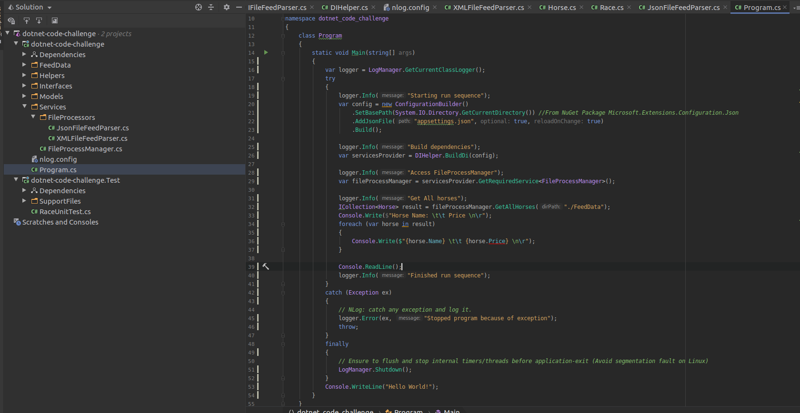
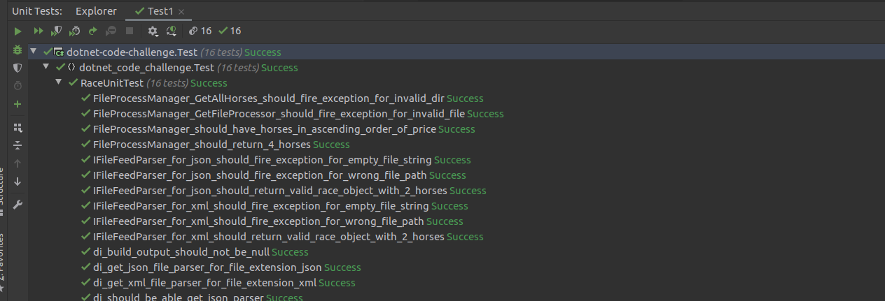
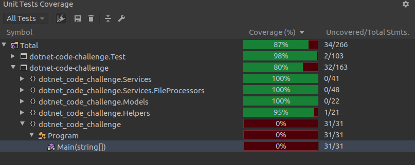
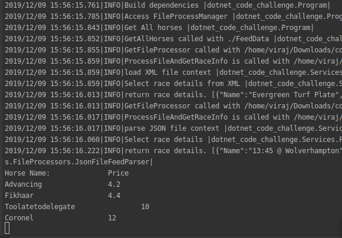

## Project title
Sample application to process different files to extract race details and horse information

## Code style
Trying to build service style with DI. Follows DDT with TDD for better testability and readability
 
## Screenshots

## Tech/framework used
.NET Core 2.2, XUnit for Testing, 

<b>Built with</b>
- .Net core

## Installation
The project is built on Linux using .NET Core
-.net core 2 SDK is needed for the built.
- Nuget is used as the package manager. Initial project load will try to restore the packaged needed and proper internet connection is requred
- use 

## Tests
Unit tests are covered to most of the code implemented. Run below command to run tests
- `dotnet test ./dotnet-code-challenge.Test`